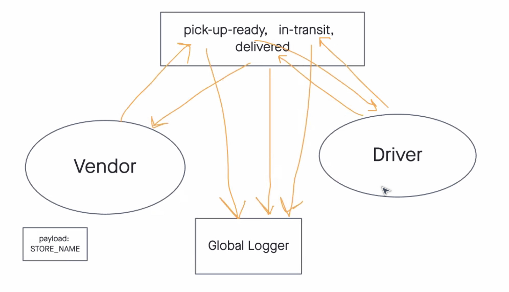

# Code Academy Parcel Service (CAPS)

A real-time service that allows for vendors, such as flower shops or restaurants, to alert a system of a package needing to be delivered, for drivers to instantly see what’s in their pickup queue, and then to alert the vendors as to the state of the deliveries (in transit, and then delivered).

## Documentation

## Contributions

Big thanks to Michael Treat for helping me comprehend the lab prompt and to and Jacob Knaack for helping be debug the test suite.
