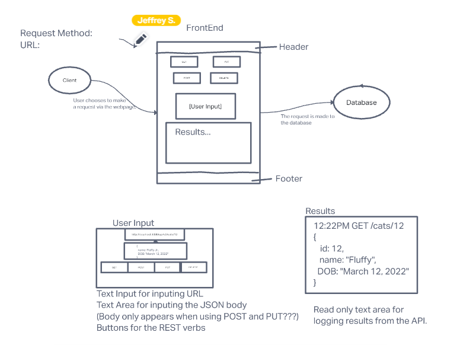

# RESTy

## Live Deploy

[Netlify](https://yamada-resty.netlify.app/)

## Overview

A React frontend for a mock RESTy system that would take user input to make REST requests. An introduction to React functional components and SCSS.

## Deployment

How do I install the app or library? 
Clone this app and install all dependencies. 
 

For Applications: 
How do I run the app? 
You can run the app on your local terminal. 
How do I set up the app? 
Be sure to install all dependencies. 

## Testing

No Tests are written for this code

## Documentation

UML 

Lab 26 & 27

