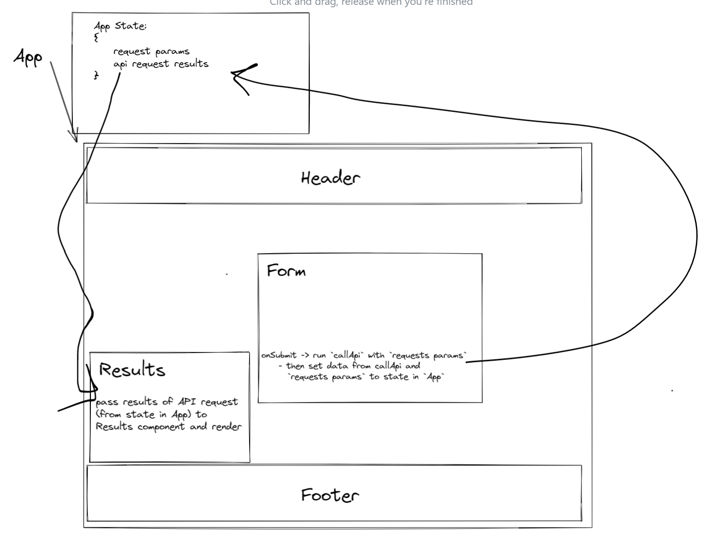

# RESTy

## Author

- Rhea Carillo

## Live Site

[Click to try RESTy here](https://rhea-resty.netlify.app/)

## Overview

This React app will allow users to test RESTful API requests by inputting a well-formatted request string and getting results, in return.

## Setup

This project currently doesn't require setup.

## Running the app

- run `npm start` to start an instance of the React App
- hit the 'GO!' button to get mock results

## Tests

No tests, yet.

## UML

