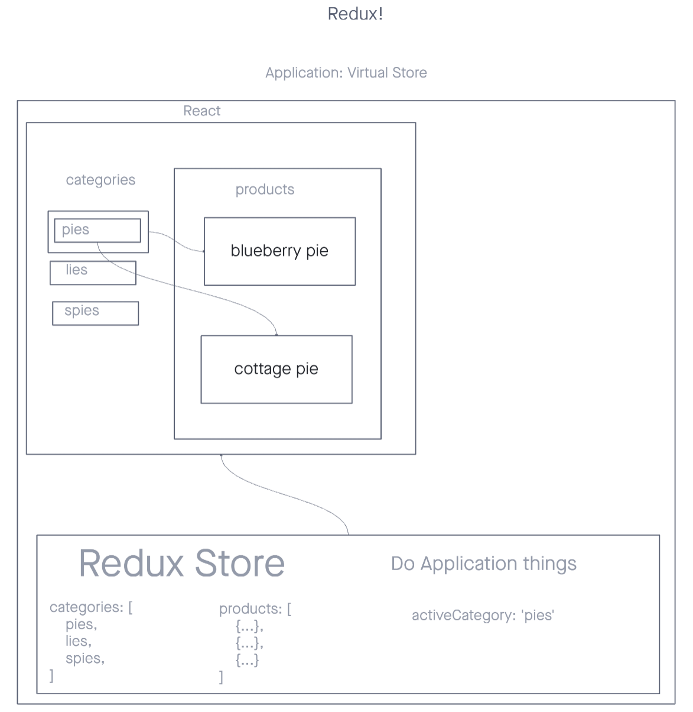

# Virtual Storefront

e-Commerce storefront using React with Redux, coupled with a live API server and Material UI

**Example Storefront**

## Deployment

[Live Storefront Deployment](https://rhea-virtual-storefront.netlify.app)

## Installation

To get started clone this repository:

> `git clone https://github.com/RheaMimiCarillo/storefront.git`

Navigate to your local directory and install dependencies:

> `npm i`

## Usage

Select a `category` from the categories menu to render a list of `products` that match your selected category.

## Documentation

Development and testing

### UML

[Virtual Storefront Whiteboard](https://projects.invisionapp.com/freehand/document/jLBOQqZE5)

### Testing

My test suite uses [RTL](https://testing-library.com/docs/react-testing-library/intro/) to cover the following cases:

1. Display a list of all `categories` from the Redux Store
2. Display a list of all `products` within a selected category
3. Displays components using Material UI
