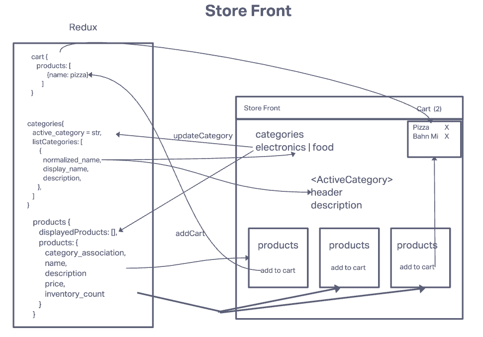

# Store Front

A store front of our store selling products like food and electronic.

## Description

Our application will power an online storefront that will allow our users to browse our product offerings by category, place items in their shopping cart, and check-out when they are ready to make their purchase.

## Getting started

### Deployed site

- URL

### Dependencies

- react
- redux
- material UI

### Installing

      npm i

### Executing Program

      npm start

## Authors

David Suy

## Business Requirements

The core requirements and functionality are as follows:

- Display a list of our product categories
- Display a listing of products for each category, when the category is selected
- From the product listings:
  - Click to view a full detail page about the product
  - Add the product to your shopping cart
- Shopping cart (simple version) always visible on screen
- Full shopping cart and check out screen available from main navigation

## Technical Requirements

- React
- ES6 Classes
- Redux Store for Application State
- Deployed API with MongoDB storage for storing categories and products
- Superagent or Axios for performing API Requests
- Material UI for layout and styling
- Test Driven Development, using Jest
- Deployment to a cloud provider (Netlify, Amplify, or GitHub Pages)

## UML

## Development Process, Milestones

Phase 1: Application Setup

- Basic React Application
- Redux State Management
- State managed in memory
- Material UI Components & Styling

Phase 2: Shopping Cart

- Add items to a shopping cart
- Update quantities
- Remove items from the cart
- Show the cart in real-time on the UI

Phase 3: Live Data

- Connect the application a live API
- Persist changes to products based on cart activity.

Phase 4: Checkout & Detail Pages

- Refactor the store to use the latest Redux design pattern (Redux Toolkit)
- Add a cart checkout page
- Add a product details page
